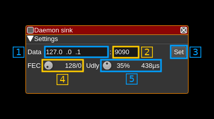

<h1>Daemon sink channel plugin</h1>

<h2>Introduction</h2>

This plugin sends I/Q samples from the baseband via UDP to a distant network end point. It can use FEC protection to prevent possible data loss inherent to UDP protocol.

It is present only in Linux binary releases.

<h2>Build</h2>

The plugin will be built only if the [CM256cc library](https://github.com/f4exb/cm256cc) is installed in your system. For CM256cc library you will have to specify the include and library paths on the cmake command line. Say if you install cm256cc in `/opt/install/cm256cc` you will have to add `-DCM256CC_INCLUDE_DIR=/opt/install/cm256cc/include/cm256cc -DCM256CC_LIBRARIES=/opt/install/cm256cc/lib/libcm256cc.so` to the cmake commands.

<h2>Interface</h2>

<h3>1: Distant address</h2>

IP address of the distant network interface from where the I/Q samples are sent via UDP

<h3>2: Data distant port</h2>

Distant port to which the I/Q samples are sent via UDP

<h3>3: Validation button</h3>

When the return key is hit within the address (1) or port (2) the changes are effective immediately. You can also use this button to set again these values. 

<h3>4: Desired number of FEC blocks per frame</h3>

This sets the number of FEC blocks per frame. A frame consists of 128 data blocks (1 meta data block followed by 127 I/Q data blocks) and a variable number of FEC blocks used to protect the UDP transmission with a Cauchy MDS block erasure correction. The two numbers next are the total number of blocks and the number of FEC blocks separated by a slash (/).

<h3>5: Delay between UDP blocks transmission</h3>

This sets the minimum delay between transmission of an UDP block (send datagram) and the next. This allows throttling of the UDP transmission that is otherwise uncontrolled and causes network congestion.

The value is a percentage of the nominal time it takes to process a block of samples corresponding to one UDP block (512 bytes). This is calculated as follows:

  - Sample rate on the network: _SR_
  - Delay percentage: _d_
  - Number of FEC blocks: _F_
  - There are 127 blocks of I/Q data per frame (1 meta block for 128 blocks) and each I/Q data block of 512 bytes (128 samples) has a 8 bytes header (2 samples) thus there are 126 samples remaining effectively. This gives the constant 127*126 = 16002 samples per frame in the formula
  
Formula: ((127 &#x2715; 126 &#x2715; _d_) / _SR_) / (128 + _F_)   

The percentage appears first at the right of the dial button and then the actual delay value in microseconds.