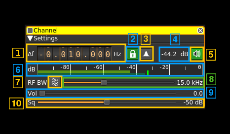

<h1>AM demodulator plugin</h1>

<h2>Introduction</h2>

This plugin can be used to listen to a narrowband amplitude modulated signal. "Narrowband" means that the bandwidth can vary from 1 to 40 kHz.

<h2>Interface</h2>

<h3>1: Frequency shift from center frequency of reception direction</h3>

The "+/-" button on the left side of the dial toggles between positive and negative shift.

<h3>2: Frequency shift from center frequency of reception value</h3>

Use the wheels to adjust the frequency shift in Hz from the center frequency of reception. Left click on a digit sets the cursor position at this digit. Right click on a digit sets all digits on the right to zero. This effectively floors value at the digit position.

<h3>3: Channel power</h3>

Average total power in dB relative to a +/- 1.0 amplitude signal received in the pass band.

<h3>4: Audio mute</h3>

Use this button to toggle audio mute for this channel. The button will light up in green if the squelch is open. This helps identifying which channels are active in a multi-channel configuration.

<h3>5: Level meter in dB</h3>

  - top bar (green): average value
  - bottom bar (blue green): instantaneous peak value
  - tip vertical bar (bright green): peak hold value

<h3>6: RF bandwidth</h3>

This is the bandwidth in kHz of the channel signal before demodulation. It can be set continuously in 1 kHz steps from 1 to 40 kHz.

<h3>7: Volume</h3>

This is the volume of the audio signal from 0.0 (mute) to 10.0 (maximum). It can be varied continuously in 0.1 steps using the dial button.

<h3>8: Squelch threshold</h3>

This is the squelch threshold in dB. The average total power received in the signal bandwidth before demodulation is compared to this value and the squelch input is open above this value. It can be varied continuously in 0.1 dB steps from 0.0 to -100.0 dB using the dial button.
