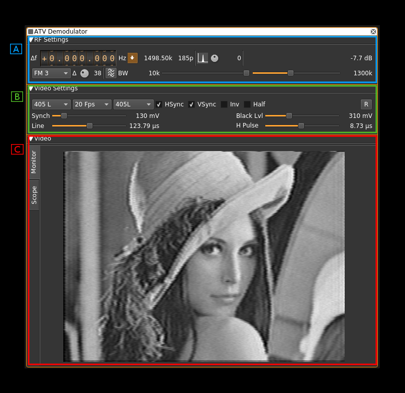

<h1>ATV demodulator plugin</h1>

<h2>Introduction</h2>

This plugin can be used to view amateur analog television transmissions a.k.a ATV. The video signal is in fact a 625 lines standard signal black and white or color (PAL, NTSC) but only the black and white levels (luminance) is retained. There is no provision to demodulate the audio subcarrier either. The modulation can be either AM or FM.

The whole bandwidth available to the channel is used. That is it runs at the device sample rate possibly downsampled by a power of two in the source plugin. It expects an integer number of MS/s and acceptable results require a sample rate of at least 6 MS/s (Airspy Mini, Airspy, BladerRF, HackRF).

<h2>Interface</h2>

<h3>1: Image</h3>

This is where the TV image appears.

<h3>2: Modulation</h3>

  - FM1: this is Frequency Modulation with approximative demodulation algorithm not using atan2
  - FM2: this is Frequency Modulation with less approximative demodulation algorithm still not using atan2
  - AM: this is Amplitude Modulation
  
For FM choose the algorithm that best suits your conditions.

<h3>3: Frames Per Second</h3>

This combo lets you chose between a 25 FPS or 30 FPS standard.

<h3>4: Horizontal sync</h3>

Check/uncheck this box to toggle horizontal synchronization processing.

<h3>5: Vertical sync</h3>

Check/uncheck this box to toggle vertical synchronization processing.

<h3>6: Half frames</h3>

Check this box to render only half of the frames for slow processors.

<h3>7: Reset defaults</h3>

Use this push button to reset values to a standard setting:

  - FM1 modulation
  - 25 FPS
  - Horizontal and vertical syncs active
  - Interlacing
  - 100 mV sync level
  - 310 mV black level
  - 64 microsecond line length
  - 3 microsecond sync length
  
<h3>8: Synchronization level</h3>

Use this slider to adjust the top level of the synchronization pulse on a 0 to 1V scale. The value in mV appears on the right of the slider. Nominal value: 100 mV.

<h3>9: Black level</h3>

Use this slider to adjust the black level of the video signal on a 0 to 1V scale. The value in mV appears on the right of the slider. Nominal value: 310 mV.

<h3>10: Line length</h3>

This is the line length in time units. The value in microseconds appears on the right of the slider. Nominal value: 64 microseconds.

<h3>10: Top length</h3>

This is the length in time units of a synchronization top. The value in microseconds appears on the right of the slider. Nominal value 3 microseconds.