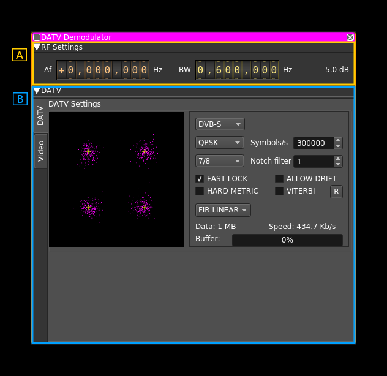
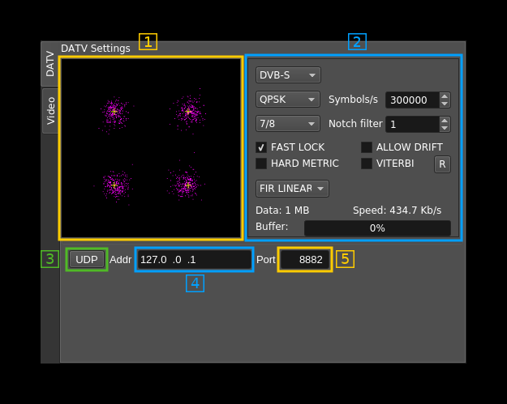
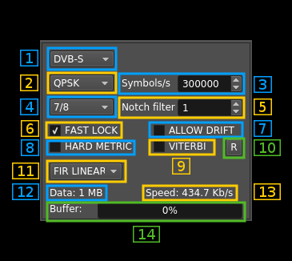
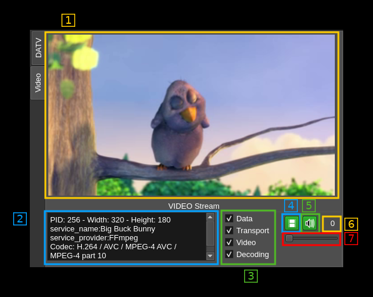

<h1>DATV demodulator plugin</h1>

<h2>Specific dependencies</h2>

  - ffmpeg
  - libavcodec-dev
  - libavformat-dev

[LeanSDR](https://github.com/pabr/leansdr) framework from F4DAV is intensively used. It has been integrated in the source tree and modified to suit SDRangel specific needs.

<h2>Introduction</h2>

This plugin can be used to view digital amateur analog television transmissions a.k.a DATV. The only supported standard for now is DVB-S in various modulations. The standard modulation is QPSK but experimental configurations with other PSK modulations (BPSK, 8PSK, QAMn) can be selected.

The whole bandwidth available to the channel is used. That is it runs at the device sample rate possibly downsampled by a power of two in the source plugin.

<h2>Interface</h2>

<h3>A: RF settings</h3>

<h4>A.1: Channel frequency shift</h4>

This is the shift of channel center frequency from RF passband center frequency

<h4>A.2: RF bandwidth</h4>

Sets the bandwidth of the channel filter

<h4>A.3: Channel power</h4>

Power of signal received in the channel (dB)

<h3>B: DATV section</h3>

<h4>B.1: Symbol constellation</h4>

This is the constellation of the PSK or QAM synchronized signal. When the demodulation parameters are set correctly (modulation type, symbol rate and filtering) and signal is strong enough to recover symbol synchronization the purple dots appear close to the white crosses. White crosses represent the ideal symbols positions in the I/Q plane.

<h4>B.2a: DATV signal settings</h4>

<h5>B.2a.1: DATV standard</h5>

For now only the DVB-S standard is available

<h5>B.2a.2: Modulation type</h5>

  - BPSK: binary phase shift keying. Symbols are in &#960;/4 and -3&#960;/4 positions.
  - QPSK: quadrature phase shift keying. Symbols are in &#960;/4, 3&#960;/4, -3&#960;/4 and -&#960;/4 positions.
  - 8PSK: 8 phase shift keying a.k.a. &#960;/4 QPSK. Symbols are in 0, &#960;/4, &#960;/2, 3&#960;/4, &#960;, -3&#960;/4, -&#960;/2 and -&#960;/4 positions
  - APSK16: amplitude and phase shift keying with 16 symbols
  - APSK32: amplitude and phase shift keying with 32 symbols
  - APSK64e: amplitude and phase shift keying with 64 symbols
  - QAM16: quadrature amplitude modulation with 16 symbols
  - QAM64: quadrature amplitude modulation with 64 symbols
  - QAM256: quadrature amplitude modulation with 256 symbols

<h5>B.2a.3: Symbol rate</h5>

This controls the expected symbol rate

<h5>B.2a.4: FEC rate</h5>

Choice between 1/2 , 2/3 , 3/4, 5/6 and 7/8.

<h5>B.2a.5: Notch filter</h5>

LeanSDR feature: attempts to fix signal spectrum shape by eliminating peaks. This is the number of peaks to be tracked. It is safer to keep the 0 default (no notch).

<h5>B.2a.6: Fast lock</h5>

Faster signal decode but may yield more errors at startup.

<h5>B.2a.7: Allow drift</h5>

Small frequency drift compensation.

<h5>B.2a.8: Hard metric</h5>

Constellation hardening (LeanSDR feature).

<h5>B.2a.9: Viterbi</h5>

Viterbi decoding. Be aware that this is CPU intensive. Should be limited to FEC 1/2 , 2/3 and 3/4 in practice.

<h5>B.2a.10: Reset to defaults</h5>

Push this button when you are lost...

<h5>B.2a.11: Filter</h5>

  - FIR Linear
  - FIR Nearest
  - RRC (Root Raised Cosine): when selected additional controls for roll-off factor (%) and excursion (dB) are provided.

<h5>B.2a.12: Amount of data decoded</h5>

Automatically adjusts unit (kB, MB, ...)

<h5>B.2a.13: Stream speed</h5>

<h5>B.2a.14: Buffer status</h5>

Gauge that shows percentage of buffer queue length

<h4>B.2b: DATV video stream</h4>

<h5>B.2b.1: Image</h5>

The decoded video is displayed here

<h5>B.2b.2: Stream information</h5>

<h5>B.2b.3: Stream decoding status</h5>

These non clickable checkboxes report the decoding status (checked when OK):

  - data: reception on going
  - transport: transport stream detected
  - video: video data detected
  - decoding: video being decoded

<h5>B.2b.4: Video mute</h5>

Toggle button to pause/run video decoding. This also indicates the video status:

  - Grey (no color): there is no video stream
  - Green: a video stream is present and successfully decoded
  - Red: a video stream is present but decoding fails

<h5>B.2b.5: Audio mute</h5>

Toggle button to pause/run audio decoding. This also indicates the audio status:

  - Grey (no color): there is no audio stream
  - Green: an audio stream is present and successfully decoded
  - Red: an audio stream is present but decoding fails

In addition right clicking on the button will give you access to the audio device selection dialog

<h5>B.2b.6: Audio volume</h5>

Show the audio volume on a 0 to 100 scale. The actual coefficient applied to the audio samples follows a logarithmic rule where 0 corresponds to 0.01, 50 to 0.1 and 100 to 1.0

<h5>B.2b.7: Audio volume control</h5>

Use this slider to control the value (0 to 100) of the audio volume.

