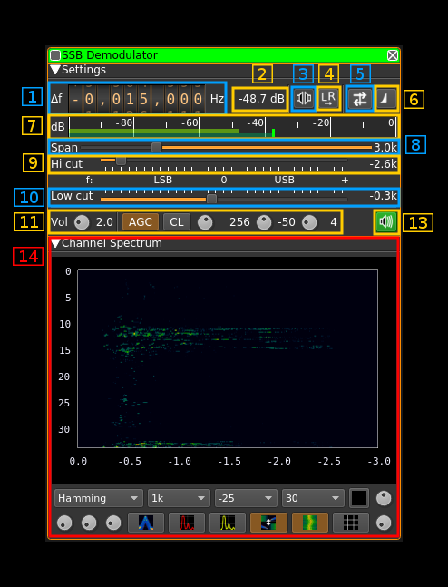

<h1>SSB/DSB demodulator plugin</h1>

<h2>Introduction</h2>

This plugin can be used to listen to a single sideband or double sidebands modulated signal. 

<h2>Interface</h2>

&#9758; In order to toggle USB or LSB mode in SSB mode you have to set the "BW" in channel filter cutoff control (9) to a positive (USB) or negative (LSB) value. The above screenshot shows a LSB setup. See the (8) to (10) paragraphs below for details.

&#9758; The channel marker in the main spectrum display shows the actual band received taking in channel filtering into account.

<h3>1: Frequency shift from center frequency of reception</h3>

Use the wheels to adjust the frequency shift in Hz from the center frequency of reception. Left click on a digit sets the cursor position at this digit. Right click on a digit sets all digits on the right to zero. This effectively floors value at the digit position. Wheels are moved with the mousewheel while pointing at the wheel or by selecting the wheel with the left mouse click and using the keyboard arroews. Pressing shift simultanoeusly moves digit by 5 and pressing control moves it by 2.

<h3>3: Channel power</h3>

Average total power in dB relative to a +/- 1.0 amplitude signal received in the pass band.

<h3>4: Monaural/binaural toggle</h3>

  - Monaural: the scalar signal is routed to both left and right audio channels
  - Binaural: the complex signal is fed with the real part on the left audio channel and the imaginary part to the right audio channel
  
<h3>5: Invert left and right channels</h3>

Inverts left and right audio channels. Useful in binaural mode only.

<h3>6: SSB/DSB demodulation</h3>

Toggles between SSB (icon with one sideband signal) and DSB (icon with double sidebands signal)

<h3>7: Level meter in dB</h3>

  - top bar (green): average value
  - bottom bar (blue green): instantaneous peak value
  - tip vertical bar (bright green): peak hold value

<h3>8: Spectrum display frequency span</h3>

The 48 kHz channel sample rate is further decimated by powers of two for the spectrum display and in channel filter limits. This effectively sets the total available bandwidth depending on the decimation:

  - 1 (no decimation): 24 kHz (SSB) or 48 kHz (DSB)
  - 2: 12 kHz (SSB) or 24 kHz (DSB)
  - 4: 6 kHz (SSB) or 12 kHz (DSB)
  - 8: 3 kHz (SSB) or 6 kHz (DSB)
  - 16: 1.5 kHz (SSB) or 3 kHz (DSB)

The span value display is set as follows depending on the SSB or DSB mode:

  - In SSB mode: the span goes from zero to the upper (USB: positive frequencies) or lower (LSB: negative frequencies) limit and the absolute value of the limit is displayed.
  - In DSB mode: the span goes from the lower to the upper limit of same absolute value and &#177; the absolute value of the limit is displayed.

This is how the Span (8) and bandpass (9, 10) fitler controls look like in the 3 possible modes:

**DSB**:

**USB**:

**LSB**:

<h3>9: "BW": In channel bandpass filter cutoff frequency farthest from zero</h3>

Values are expressed in kHz and step is 100 Hz.

  - In SSB mode this is the upper (USB: positive frequencies) or lower (LSB: negative frequencies) cutoff of the in channel single side band bandpass filter. The value triggers LSB mode when negative and USB when positive
  - In DSB mode this is half the bandwidth of the double side band in channel bandpass filter therefore the value is prefixed with the &#177; sign. 

<h3>10: "Low cut": In channel bandpass filter cutoff frequency closest to zero</h3>

Values are expressed in kHz and step is 100 Hz.

  - In SSB mode this is the lower cutoff (USB: positive frequencies) or higher cutoff (LSB: negative frequencies) of the in channel signe side band bandpass filter.
  - In DSB mode it is inactive and set to zero (double side band filter).

<h3>11: Volume</h3>

This is the volume of the audio signal from 0.0 (mute) to 10.0 (maximum). It can be varied continuously in 0.1 steps using the dial button.

<h3>12: Audio mute</h3>

Use this button to toggle audio mute for this channel.

<h3>13: Spectrum display</h3>

This is the spectrum display of the demodulated signal (SSB) or translated signal (DSB). Controls on the bottom of the panel are identical to the ones of the main spectrum display.