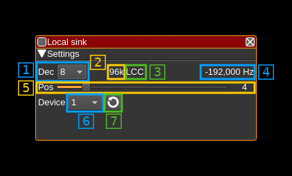

<h1>Local sink channel plugin</h1>

<h2>Introduction</h2>

This plugin sends I/Q samples from the baseband to a Local Input plugin source in another device set.

<h2>Interface</h2>

<h3>1: Decimation factor</h3>

The device baseband can be decimated in the channel and its center can be selected with (5). The resulting sample rate of the I/Q stream sent over the network is the baseband sample rate divided by this value. The value is displayed in (2).

<h3>2: I/Q stream sample rate</h3>

This is the sample rate in kS/s of the I/Q stream sent to the Local Input source instance.

<h3>3: Half-band filters chain sequence</h3>

This string represents the sequence of half-band filters used in the decimation from device baseband to resulting I/Q stream. Each character represents a filter type:

  - **L**: lower half-band
  - **H**: higher half-band
  - **C**: centered

<h3>4: Center frequency shift</h3>

This is the shift of the channel center frequency from the device center frequency. Its value is driven by the device sample rate , the decimation (1) and the filter chain sequence (5).

<h3>5: Half-band filter chain sequence</h3>

The slider moves the channel center frequency roughly from the lower to the higher frequency in the device baseband. The number on the right represents the filter sequence as the decimal value of a base 3 number. Each base 3 digit represents the filter type and its sequence from MSB to LSB in the filter chain:

  - **0**: lower half-band
  - **1**: centered
  - **2**: higher half-band

<h3>6: Local Input source index</h2>

This selects the index of the Local Input source where to send the I/Q samples. The list can be refreshed with the next button (7)

<h3>7: Refresh local input devices list</h2>

Use this button to refresh the list of Local Input sources indexes.
