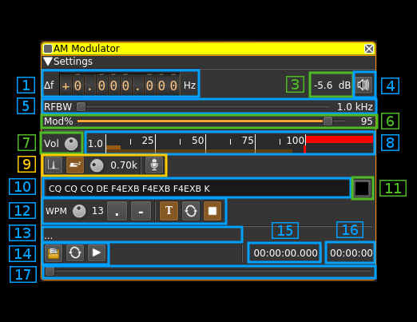
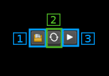

<h1>AM modulator plugin</h1>

<h2>Introduction</h2>

This plugin can be used to generate a narrowband amplitude modulated signal. "Narrowband" means that the bandwidth can vary from 1 to 40 kHz.

<h2>Interface</h2>

<h3>1: Frequency shift from center frequency of reception direction</h3>

The "+/-" button on the left side of the dial toggles between positive and negative shift.

<h3>2: Frequency shift from center frequency of reception value</h3>

Use the wheels to adjust the frequency shift in Hz from the center frequency of reception. Left click on a digit sets the cursor position at this digit. Right click on a digit sets all digits on the right to zero. This effectively floors value at the digit position.

<h3>3: Channel power</h3>

Average total power in dB relative to a +/- 1.0 amplitude signal generated in the pass band.

<h3>4: Audio mute</h3>

Use this button to toggle audio mute for this channel.

<h3>5: RF bandwidth</h3>

This is the bandwidth in kHz of the channel signal filtered after modulation. It can be set continuously in 1 kHz steps from 1 to 40 kHz.

<h3>6: Modulation level</h3>

Adjusts the AM modulation level in %

<h3>7: Volume</h3>

This is the volume of the audio signal from 0.0 (mute) to 2.0 (maximum). It can be varied continuously in 0.1 steps using the dial button.

<h3>8: Level meter in %</h3>

  - top bar (beige): average value
  - bottom bar (brown): instantaneous peak value
  - tip vertical bar (bright red): peak hold value

You should aim at keepimg the peak value below 100% using the volume control

<h3>9: Input source control</h3>

<h4>9.1: Tone input select</h4>

Switches to the tone input. You must switch it off to make other inputs available.

<h4>9.2: Morse keyer input select</h4>

Switches to the Morse keyer input. You must switch it off to make other inputs available.

<h4>9.3: Tone frequency (kHz)</h4>

Adjusts the tone frequency from 0.1 to 2.5 kHz in 0.01 kHz steps

<h4>9.4: Audio input select</h4>

Switches to the audio input. You must switch it off to make other inputs available.

<h3>10: CW (Morse) text</h3>

Enter the text to be keyed when Morse input is active and in text mode

<h3>11: Clear CW text</h3>

Clears the CW (Morse) text

<h3>12: Morse keyer controls</h3>

<h4>12.1: CW keying speed</h4>

Sets the CW speed in Words Per Minute (WPM). This is based on the word "PARIS" sent 5 times. For 5 WPM the dot length is 240 ms. In other terms the dot length is calculated as 1.2 / WPM seconds. The dot length is used as the base to compute other timings:

  - Element (dot or dash) silence separator: 1 dot length
  - Dash: 3 dot lengths
  - Character silence separator: 3 dot lengths
  - Word silence separator: 7 dot lengths
  
<h4>12.2: Dots keying</h4>

Switch this button to send dots continuously

<h4>12.3: Dashes keying</h4>

Switch this button to send dashes continuously

<h4>12.4: Text keying</h4>

Switch this button to send the text typed into the text box (10)

<h4>12.5: Text auto repeat</h4>

Switch this button to auto repeat the text keying

<h4>12.6: Text play/stop</h4>

Use this button to stop sending text. When resuming keying restarts at the start of text

<h3>13: Audio file path</h3>

The path to the selected audio file to be played or dots if unselected

<h3>14: Audio file play controls</h3>

<h4>14.1: Audio file select</h4>

Opens a file dialog to select the audio file to be played. It must be mono 48 kHz 16LE raw format.

<h4>14.2: Audio file loop</h4>

Audio replay file at the end

<h4>14.3: Play/pause file play</h4>

Toggle play/pause file play. When paused the slider below (17) can be used to randomly set the position in the file when re-starting.

<h3>15: Play file current position</h3>

This is the current audio file play position in time units relative to the start

<h3>16: Play file length</h3>

This is the audio file play length in time units

<h3>17: Play file position slider</h3>

This slider can be used to randomly set the currennt position in the file when file play is in pause state (button 14.3)