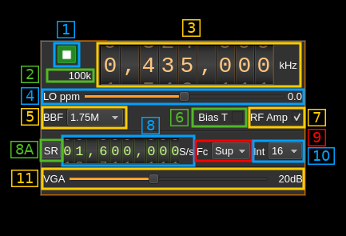
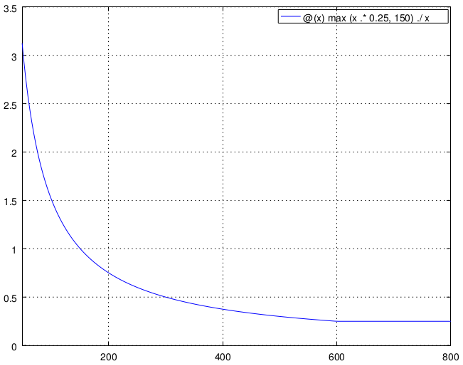

<h1>HackRF output plugin</h1>

<h2>Introduction</h2>

This output sample sink plugin sends its samples to a [HackRF device](https://greatscottgadgets.com/hackrf/).

<h2>Build</h2>

The plugin will be built only if the [HackRF host library](https://github.com/mossmann/hackrf) is installed in your system. If you build it from source and install it in a custom location say: `/opt/install/libhackrf` you will have to add `-DLIBHACKRF_INCLUDE_DIR=/opt/install/libhackrf/include -DLIBHACKRF_LIBRARIES=/opt/install/libhackrf/lib/libhackrf.so` to the cmake command line.

The HackRF Host library is also provided by many Linux distributions and is built in the SDRangel binary releases.

<h2>Interface</h2>

<h3>1: Start/Stop</h3>

Device start / stop button. 

  - Blue triangle icon: device is ready and can be started
  - Red square icon: device is running and can be stopped
  - Magenta (or pink) square icon: an error occured. In the case the device was accidentally disconnected you may click on the icon, plug back in and start again.

If you have the Rx open in another tab and it is running then it will be stopped automatically before the Tx starts. In a similar manner the Tx will be stopped before the Rx is started from the Rx tab.

The settings on Tx or Rx tab are reapplied on start so these settings can be considered independent.
  
<h3>2: Baseband sample rate</h3>

This is the baseband sample rate in kS/s before interpolation (5) to produce the final stream that is sent to the HackRF device. Thus this is the device sample rate (8) divided by the interpolation factor (5).

Transmission latency depends essentially in the delay in the sample FIFO. The size of sample FIFO is calculated to give a fixed delay of 250 ms or 150000 samples whichever is bigger. Below is the delay in seconds vs baseband sample rate in kS/s from 48 to 800 kS/s. The 250 ms delay is reached at 600 kS/s:

 
  
<h3>3: Frequency</h3>

This is the center frequency of transmission in kHz.

<h3>4: Local Oscillator correction</h3>

Use this slider to adjust LO correction in ppm. It can be varied from -10.0 to 10.0 in 0.1 steps and is applied in software.

<h3>5: Interpolation factor</h3>

The baseband stream is interpolated by this value before being sent to the HackRF device. Possible values are:

  - **1**: no interpolation
  - **2**: multiply baseband stream sample rate by 2
  - **4**: multiply baseband stream sample rate by 4
  - **8**: multiply baseband stream sample rate by 8
  - **16**: multiply baseband stream sample rate by 16
  - **32**: multiply baseband stream sample rate by 32

The main samples buffer is based on the baseband sample rate and will introduce ~500ms delay for interpolation by 16 or lower and ~1s for interpolation by 32.  

<h3>6: Bias tee</h3>

Use this checkbox to toggle the +5V power supply on the antenna connector.

<h3>7:RF amp</h3>

Use this checkbox to toggle the output amplifier (PA). This PA gives an additional gain of 14 dB. 

According to HackRF documentation the output power when the PA is engaged and the Tx VGA (10) is at full power (47dB) is the following:

  - 10 MHz to 2150 MHz: 5 dBm to 15 dBm, generally increasing as frequency decreases
  - 2150 MHz to 2750 MHz: 13 dBm to 15 dBm
  - 2750 MHz to 4000 MHz: 0 dBm to 5 dBm, increasing as frequency decreases
  - 4000 MHz to 6000 MHz: -10 dBm to 0 dBm, generally increasing as frequency decreases

<h3>8: Device sample rate</h3>

This is the HackRF device DAC sample rate in S/s.

Use the wheels to adjust the sample rate. Left click on a digit sets the cursor position at this digit. Right click on a digit sets all digits on the right to zero. This effectively floors value at the digit position. Wheels are moved with the mousewheel while pointing at the wheel or by selecting the wheel with the left mouse click and using the keyboard arroews. Pressing shift simultanoeusly moves digit by 5 and pressing control moves it by 2.

<h3>9: Tx filter bandwidth</h3>

This is the Tx filter bandwidth in kHz. Possible values are: 1750, 2500, 3500, 5000, 5500, 6000, 7000, 8000, 9000, 10000, 12000, 14000, 15000, 20000, 24000, 28000 kHz.

<h3>10: Tx variable gain amplifier gain</h3>

The Tx VGA gain can be adjusted from 0 dB to 47 dB in 1 dB steps. See (7) for an indication on maximum output power.