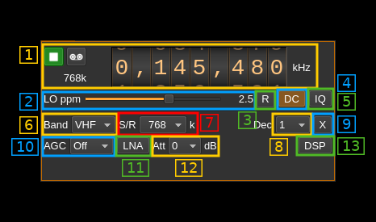
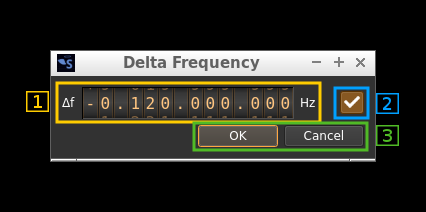

<h1>AirspyHF input plugin</h1>

<h2>Introduction</h2>

This input sample source plugin gets its samples from a [Airspy HF+ device](https://airspy.com/airspy-hf-plus/). 

<h2>Build</h2>

The plugin will be built only if the [Airspy HF library](https://github.com/airspy/airspyhf) is installed in your system. 

If you build it from source and install it in a custom location say: `/opt/install/libairspyhf` you will have to add `-DLIBRTLSDR_INCLUDE_DIR=/opt/install/libairspyhf/include -DLIBRTLSDR_LIBRARIES=/opt/install/libairspyhf/lib/libairspyhf.so` to the cmake command line.

Note: if you use binary distributions this is included in the bundle.

<h2>Interface</h2>

It has very few controls compared to other source interfaces. This is because a lot of things are handled automatically with the AirspyHF+:

  - gains (hardware)
  - DC and IQ correction (library software)

<h3>1: Common stream parameters</h3>

<h4>1.1: Frequency</h4>

This is the center frequency of reception in kHz.

<h4>1.2: Start/Stop</h4>

Device start / stop button. 

  - Blue triangle icon: device is ready and can be started
  - Green square icon: device is running and can be stopped
  - Magenta (or pink) square icon: an error occured. In the case the device was accidentally disconnected you may click on the icon, plug back in and start again.
  
<h4>1.3: Record</h4>

Record baseband I/Q stream toggle button

<h4>1.4: Stream sample rate</h4>

Baseband I/Q sample rate in kS/s. This is the device to host sample rate (3) divided by the decimation factor (4). 

<h3>2: Lo ppm correction</h3>

This is the correction factor in ppm applied to the local oscillator. The Airspy HF LO has 1 kHz increments so anything in between is obtained by mixing the signal with a Hz precision NCO. This is actually done in the AirspyHF library.

On HF band the LO correction is not necessary because the LO is largely precise enough for the frequencies involved. You can disable the NCO in AirspyHF library by setting the value to zero. Since the LO control in SDRangel has a 1 kHz step the NCO correction will always be zero. In AirspyHF library (my fork) the NCO is not active (no extra complex multiplication) if the correction is zero. On HF band it is recommended not to use the LO correction (set it or leave it at 0). 

You can reset the ppm value anytime by pressing on button (3)

<h3>3: Reset LO ppm correction</h3>

THis resets the LO ppm correction (zero the value). By doing so the LO trimming NCO in AirspyHF libray is disabled.

<h3>4: Band select</h3>

Use this combo box to select the HF or VHF range. This will set the limits of the frequency dial (1.1) appropriately and possibly move the current frequency inside the limits. Limits are given by the AirspyHF+ specifications:

  - HF: 9 kHz to 31 MHz
  - VHF: 60 to 260 MHz

<h3>5: Device to hast sample rate</h3>

This is the device to host sample rate in samples per second (S/s).

Although the combo box is there to present a choice of sample rates at present the AirspyHF+ deals only with 768 kS/s. However the support library has provision to get a list of sample rates from the device incase of future developments.

<h3>6: Decimation factor</h3>

The I/Q stream from the AirspyHF to host is downsampled by a power of two before being sent to the passband. Possible values are increasing powers of two: 1 (no decimation), 2, 4, 8, 16, 32, 64. When using audio channel plugins (AM, DSD, NFM, SSB...) please make sure that the sample rate is not less than 48 kHz (no decimation by 32 or 64).

<h3>7: Transverter mode open dialog</h3>

This button opens a dialog to set the transverter mode frequency translation options:

Note that if you mouse over the button a tooltip appears that displays the translating frequency and if translation is enabled or disabled. When the frequency translation is enabled the button is lit.

<h4>7a.1: Translating frequency</h4>

You can set the translating frequency in Hz with this dial. Use the wheels to adjust the sample rate. Left click on a digit sets the cursor position at this digit. Right click on a digit sets all digits on the right to zero. This effectively floors value at the digit position. Wheels are moved with the mousewheel while pointing at the wheel or by selecting the wheel with the left mouse click and using the keyboard arroews. Pressing shift simultanoeusly moves digit by 5 and pressing control moves it by 2.

The frequency set in the device is the frequency on the main dial (1) minus this frequency. Thus it is positive for down converters and negative for up converters. 

For example with the DX Patrol that has a mixer at 120 MHz for HF operation you would set the value to -120,000,000 Hz so that if the main dial frequency is set at 7,130 kHz the RTLSDR of the DX Patrol will be set to 127.130 MHz.

If you use a down converter to receive the 6 cm band narrowband center frequency of 5670 MHz at 432 MHz you would set the translating frequency to 5760 - 432 = 5328 MHz thus dial +5,328,000,000 Hz.

For bands even higher in the frequency spectrum the GHz digits are not really significant so you can have them set at 1 GHz. Thus to receive the 10368 MHz frequency at 432 MHz you would set the translating frequency to 1368 - 432 = 936 MHz. Note that in this case the frequency of the LO used in the mixer of the transverter is set at 9936 MHz.

The Hz precision allows a fine tuning of the transverter LO offset

<h4>7a.2: Translating frequency enable/disable</h4>

Use this toggle button to activate or deactivate the frequency translation

<h4>7a.3: Confirmation buttons</h4>

Use these buttons to confirm ("OK") or dismiss ("Cancel") your changes. 
