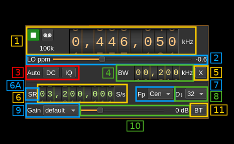

<h1>BladeRF 2.0 micro (v2) input plugin</h1>

<h2>Introduction</h2>

This input sample source plugin gets its samples from a [BladeRF 2.0 micro device](https://www.nuand.com/bladerf-2) using LibbladeRF v.2. This is available since v4.2.0 in Linux distributions only.

<h2>Build</h2>

The plugin will be built only if the [BladeRF host library](https://github.com/Nuand/bladeRF) is installed in your system. If you build it from source and install it in a custom location say: `/opt/install/libbladeRF` you will have to add `-DLIBBLADERF_INCLUDE_DIR=/opt/install/libbladeRF/include -DLIBBLADERF_LIBRARIES=/opt/install/libbladeRF/lib/libbladeRF.so` to the cmake command line.

Note that libbladeRF v2 with git tag 2018.08 should be used (official release). The FPGA image v0.7.3 should be used accordingly. The FPGA .rbf file should be copied to the folder where the `sdrangel` binary resides. You can download FPGA images from [here](https://www.nuand.com/fpga_images/)

The BladeRF Host library is also provided by many Linux distributions (check its version) and is built in the SDRangel binary releases.

<h2>Interface</h2>

<h3>1: Common stream parameters</h3>

<h4>1.1: Frequency</h4>

This is the center frequency of reception in kHz. The center frequency is the same for all Rx channels. The GUI of the sibling channel if present is adjusted automatically.

<h4>1.2: Start/Stop</h4>

Device start / stop button. 

  - Blue triangle icon: device is ready and can be started
  - Green square icon: device is running and can be stopped
  - Magenta (or pink) square icon: an error occurred. In the case the device was accidentally disconnected you may click on the icon, plug back in and start again.
  
<h4>1.3: Record</h4>

Record baseband I/Q stream toggle button

<h4>1.4: Stream sample rate</h4>

Baseband I/Q sample rate in kS/s. This is the device sample rate (4) divided by the decimation factor (6). 

<h3>2: Auto correction options</h3>

These buttons control the local DSP auto correction options:

  - **DC**: auto remove DC component
  - **IQ**: auto make I/Q balance. The DC correction must be enabled for this to be effective.
  
<h3>3: Rx filter bandwidth</h3>

This is the Rx filter bandwidth in kHz. Minimum and maximum values are adjusted automatically. Normal range is from 200 kHz to 56 MHz. The Rx filter bandwidth is the same for all Rx channels. The GUI of the sibling channel if present is adjusted automatically.

<h3>4: Bias tee control</h3>

Use this toggle button to activate or de-activate the bias tee. Note that according to BladeRF v2 specs the bias tee is simultanously present on all Rx RF ports. The GUI of the sibling channel if present is adjusted automatically.

<h3>5: Device sample rate</h3>

This is the BladeRF device ADC sample rate in S/s.

Use the wheels to adjust the sample rate. Left click on a digit sets the cursor position at this digit. Right click on a digit sets all digits on the right to zero. This effectively floors value at the digit position. Wheels are moved with the mousewheel while pointing at the wheel or by selecting the wheel with the left mouse click and using the keyboard arrows. Pressing shift simultaneously moves digit by 5 and pressing control moves it by 2.

The ADC sample rate is the same for all Rx channels. The GUI of the sibling channel if present is adjusted automatically.

<h3>6: Baseband center frequency position relative the the BladeRF Rx center frequency</h3>

Possible values are:

  - **Cen**: the decimation operation takes place around the BladeRF Rx center frequency Fs
  - **Inf**: the decimation operation takes place around Fs - Fc. 
  - **Sup**: the decimation operation takes place around Fs + Fc.
  
With SR as the sample rate before decimation Fc is calculated as: 

  - if decimation n is 4 or lower:  Fc = SR/2^(log2(n)-1). The device center frequency is on the side of the baseband. You need a RF filter bandwidth at least twice the baseband.
  - if decimation n is 8 or higher: Fc = SR/n. The device center frequency is half the baseband away from the side of the baseband. You need a RF filter bandwidth at least 3 times the baseband.

<h3>7: Decimation factor</h3>

The I/Q stream from the BladeRF ADC is downsampled by a power of two before being sent to the passband. Possible values are increasing powers of two: 1 (no decimation), 2, 4, 8, 16, 32, 64.

<h3>8: Gain mode</h2>

This selects the gain processing in use. Values are fetched automatically from the device. Normal values are

  - **default**: AGC with default behavior
  - **Manual**: Manual. Use control (9) to adjust gain
  - **fast**: fast AGC
  - **slow**: slow AGC
  - **hybrid**: hybrid AGC

<h3>9: Manual gain control</h3>

Use this slider to adjust gain in manual mode. This control is disabled in non manual modes (all modes but manual). The minumum, maximum and step values are fetched automatically from the device and may vary depending on the center frequency. For frequencies around 400 MHz the gain varies from -16 to 60 dB in 1 dB steps.
