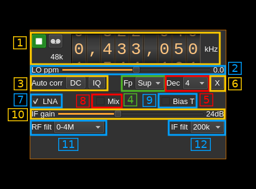

<h1>FunCube Dongle Pro+ input plugin</h1>

<h2>Introduction</h2>

This input sample source plugin gets its samples from a [FunCube Dongle (FCD) Pro+ device](http://www.funcubedongle.com/?page_id=1073).

<h2>Interface</h2>

<h3>1: Common stream parameters</h3>

<h4>1.1: Frequency</h4>

This is the center frequency of reception in kHz.

<h4>1.2: Start/Stop</h4>

Device start / stop button.

  - Blue triangle icon: device is ready and can be started
  - Green square icon: device is running and can be stopped
  - Magenta (or pink) square icon: an error occurred. In the case the device was accidentally disconnected you may click on the icon, plug back in and start again.

<h4>1.3: Record</h4>

Record baseband I/Q stream toggle button

<h4>1.4: Stream sample rate</h4>

Baseband I/Q sample rate in kS/s. This is the device sample rate (4) divided by the decimation factor (6).

<h3>2: Local Oscillator correction</h3>

This is the correction to be applied to the local oscillator in ppm.

<h3>3: Auto correction options</h3>

These buttons control the local DSP auto correction options:

  - **DC**: auto remove DC component
  - **IQ**: auto make I/Q balance. The DC correction must be enabled for this to be effective.

<h3>4: Decimated bandpass center frequency position relative the FCD Pro+ center frequency</h3>

  - **Cen**: the decimation operation takes place around the FCD Pro+ center frequency Fs
  - **Inf**: the decimation operation takes place around Fs - Fc.
  - **Sup**: the decimation operation takes place around Fs + Fc.

With SR as the sample rate before decimation Fc is calculated as:

  - if decimation n is 4 or lower:  Fc = SR/2^(log2(n)-1). The device center frequency is on the side of the baseband. You need a RF filter bandwidth at least twice the baseband.
  - if decimation n is 8 or higher: Fc = SR/n. The device center frequency is half the baseband away from the side of the baseband. You need a RF filter bandwidth at least 3 times the baseband.

<h3>5: Decimation factor</h3>

The I/Q stream from the FCD Pro+ ADC is downsampled by a power of two before being sent to the passband. Possible values are increasing powers of two: 1 (no decimation), 2, 4, 8, 16.

<h3>6: Transverter mode open dialog</h3>

This button opens a dialog to set the transverter mode frequency translation options:

Note that if you mouse over the button a tooltip appears that displays the translating frequency and if translation is enabled or disabled. When the frequency translation is enabled the button is lit.

<h4>6.1: Translating frequency</h4>

You can set the translating frequency in Hz with this dial. Use the wheels to adjust the sample rate. Left click on a digit sets the cursor position at this digit. Right click on a digit sets all digits on the right to zero. This effectively floors value at the digit position. Wheels are moved with the mousewheel while pointing at the wheel or by selecting the wheel with the left mouse click and using the keyboard arrows. Pressing shift simultaneously moves digit by 5 and pressing control moves it by 2.

The frequency set in the device is the frequency on the main dial (1) minus this frequency. Thus it is positive for down converters and negative for up converters.

For example with the DX Patrol that has a mixer at 120 MHz for HF operation you would set the value to -120,000,000 Hz so that if the main dial frequency is set at 7,130 kHz the FCD Pro+ of the DX Patrol will be set to 127.130 MHz.

If you use a down converter to receive the 6 cm band narrowband center frequency of 5670 MHz at 432 MHz you would set the translating frequency to 5760 - 432 = 5328 MHz thus dial +5,328,000,000 Hz.

For bands even higher in the frequency spectrum the GHz digits are not really significant so you can have them set at 1 GHz. Thus to receive the 10368 MHz frequency at 432 MHz you would set the translating frequency to 1368 - 432 = 936 MHz. Note that in this case the frequency of the LO used in the mixer of the transverter is set at 9936 MHz.

The Hz precision allows a fine tuning of the transverter LO offset

<h4>6.2: Translating frequency enable/disable</h4>

Use this toggle button to activate or deactivate the frequency translation

<h4>6.3: Confirmation buttons</h4>

Use these buttons to confirm ("OK") or dismiss ("Cancel") your changes.

<h3>7: LNA toggle</h3>

This checkbox is used to toggle the LNA on/off

<h3>8: Mix toggle</h3>

This checkbox is used to toggle mixer amplifier on/off

<h3>9: Bias tee</h3>

Use this checkbox to activate the bias tee.

<h3>10: If gain</h3>

Use this slider to adjust the gain of the IF amplifier.

<h3>10: RF filter</h3>

This controls the tuner filter (band) used:

<h3>11: IF filter</h2>

Selects the IF filter bandwidth