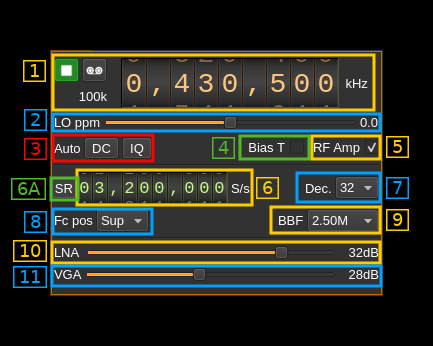

<h1>HackRF input plugin</h1>

<h2>Introduction</h2>

This intput sample source plugin gets its samples from a [HackRF device](https://greatscottgadgets.com/hackrf/).

<h2>Build</h2>

The plugin will be built only if the [HackRF host library](https://github.com/mossmann/hackrf) is installed in your system. If you build it from source and install it in a custom location say: `/opt/install/libhackrf` you will have to add `-DLIBHACKRF_INCLUDE_DIR=/opt/install/libhackrf/include -DLIBHACKRF_LIBRARIES=/opt/install/libhackrf/lib/libhackrf.so` to the cmake command line.

The HackRF Host library is also provided by many Linux distributions and is built in the SDRangel binary releases.

<h2>Interface</h2>

<h3>1: Common stream parameters</h3>

<h4>1.1: Frequency</h4>

This is the center frequency of reception in kHz.

<h4>1.2: Start/Stop</h4>

Device start / stop button. 

  - Blue triangle icon: device is ready and can be started
  - Green square icon: device is running and can be stopped
  - Red square icon: an error occured. In the case the device was accidentally disconnected you may click on the icon, plug back in and start again.
  
Please note that HackRF is a half duplex device so if you have the Tx open in another tab you have to stop it first before starting the Rx for it to work properly. In a similar manner you should stop the Rx before resuming the Tx.

The settings on Tx or Rx tab are reapplied on start so provided the half duplex is handled correctly as stated above these settings can be considered independent.

<h4>1.3: Record</h4>

Record baseband I/Q stream toggle button

<h4>1.4: Baseband sample rate</h4>

Baseband I/Q sample rate in kS/s. This is the device sample rate (4) divided by the decimation factor (6). 

<h3>2: Local Oscillator correction</h3>

Use this slider to adjust LO correction in ppm. It can be varied from -10.0 to 10.0 in 0.1 steps and is applied in software.

<h3>3: Auto correction options</h3>

These buttons control the local DSP auto correction options:

  - **DC**: auto remove DC component
  - **IQ**: auto make I/Q balance
  
<h3>4: Bias tee</h3>

Use this checkbox to toggle the +5V power supply on the antenna connector.

<h3>5:RF amp</h3>

Use this checkbox to toggle the extra low noise amplifier (LNA). This gives an additional gain of 14 dB. 

<h3>6: Device sample rate</h3>

This is the HackRF device ADC sample rate in S/s.

Use the wheels to adjust the sample rate. Left click on a digit sets the cursor position at this digit. Right click on a digit sets all digits on the right to zero. This effectively floors value at the digit position. Wheels are moved with the mousewheel while pointing at the wheel or by selecting the wheel with the left mouse click and using the keyboard arroews. Pressing shift simultanoeusly moves digit by 5 and pressing control moves it by 2.

<h3>7: Rx filter bandwidth</h3>

This is the Rx filter bandwidth in kHz. Possible values are: 1750, 2500, 3500, 5000, 5500, 6000, 7000, 8000, 9000, 10000, 12000, 14000, 15000, 20000, 24000, 28000 kHz.

<h3>8: Decimation factor</h3>

The device stream from the HackRF is decimated to obtain the baseband stream. Possible values are:

  - **1**: no decimation
  - **2**: divide devcie stream sample rate by 2
  - **4**: divide devcie stream sample rate by 4
  - **8**: divide devcie stream sample rate by 8
  - **16**: divide devcie stream sample rate by 16
  - **32**: divide devcie stream sample rate by 32

<h3>10: Internal LNA gain</h3>

The LNA gain can be adjusted from 0 dB to 40 dB in 8 dB steps.

<h3>11: Rx variable gain amplifier gain</h3>

The Rx VGA gain can be adjusted from 0 dB to 62 dB in 2 dB steps.
