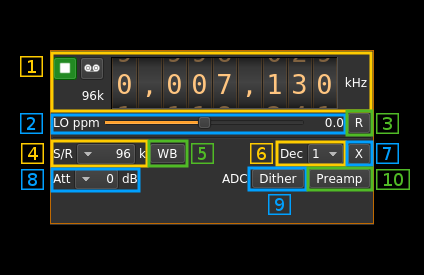

<h1>Perseus input plugin</h1>

<h2>Introduction</h2>

This input sample source plugin gets its samples from a [Perseus device](http://microtelecom.it/perseus/). 

<h2>Build</h2>

The plugin will be built only if the [perseus-sdr library](https://github.com/Microtelecom/libperseus-sdr) is installed in your system and you are building for the 24 bit Rx DSP chain with the `-DRX_SAMPLE_24BIT=ON` option. 

If you build it from source and install it in a custom location say: `/opt/install/libperseus` you will have to add `-DLIBPERSEUS_INCLUDE_DIR=/opt/install/libperseus/include -DLIBPERSEUS_LIBRARIES=/opt/install/libperseus/lib/libperseus-sdr.so` to the cmake command line.

Note: if you use binary distributions this is included in the bundle.

<h2>Interface</h2>

It has a limited number of controls compared to other source interfaces. This is because a lot of things are handled automatically within the Perseus:

  - gains
  - DC and IQ correction
  - filter selection based on frequency

<h3>1: Common stream parameters</h3>

<h4>1.1: Frequency</h4>

This is the center frequency of reception in kHz.

<h4>1.2: Start/Stop</h4>

Device start / stop button. 

  - Blue triangle icon: device is ready and can be started
  - Green square icon: device is running and can be stopped
  - Magenta (or pink) square icon: an error occured. In the case the device was accidentally disconnected you may click on the icon, plug back in and start again.
  
<h4>1.3: Record</h4>

Record baseband I/Q stream toggle button

<h4>1.4: Stream sample rate</h4>

Baseband I/Q sample rate in kS/s. This is the device to host sample rate (3) divided by the decimation factor (4). 

<h3>2: LO ppm correction</h3>

This is the correction factor in ppm applied to the local oscillator in software. This is normally not needed the Perseus is already on spot. You can reset the ppm value anytime by pressing on button (3)

<h3>3: Reset LO ppm correction</h3>

This resets the LO ppm correction (zero the value).

<h3>4: Device to hast sample rate</h3>

This is the device to host sample rate in kilo samples per second (kS/s). With a recent (well: ~2011) version of the firmware it can be as low as 48 kS/s so there is no need for software decimation.

<h3>5: Wideband mode</h5>

Switch on this button to disable the preselection filters. The corresponding LED on the Perseus front panel will be lit accordingly.

<h3>6: Decimation factor</h3>

The I/Q stream from the Perseus to host is downsampled by a power of two before being sent to the passband. This is normally not needed for most use cases as the Perseus can go as low as 48 kS/s which is the lower limit for audio channel plugins (AM, FM, SSB, Digital voice). So it can be left to `1` most of the time. A software decimation by 2 or 4 is still provided for easier anaysis of very narrowband or slow varying signals. Note that there is no dynamic gain with this decimation as the precision is already limited to 24 significant bits either for integer or floating point (float) processing.

<h3>7: Transverter mode open dialog</h3>

This button opens a dialog to set the transverter mode frequency translation options:

Note that if you mouse over the button a tooltip appears that displays the translating frequency and if translation is enabled or disabled. When the frequency translation is enabled the button is lit.

<h4>7a.1: Translating frequency</h4>

You can set the translating frequency in Hz with this dial. Use the wheels to adjust the sample rate. Left click on a digit sets the cursor position at this digit. Right click on a digit sets all digits on the right to zero. This effectively floors value at the digit position. Wheels are moved with the mousewheel while pointing at the wheel or by selecting the wheel with the left mouse click and using the keyboard arroews. Pressing shift simultanoeusly moves digit by 5 and pressing control moves it by 2.

The frequency set in the device is the frequency on the main dial (1) minus this frequency. Thus it is positive for down converters and negative for up converters. 

For example with the DX Patrol that has a mixer at 120 MHz for HF operation you would set the value to -120,000,000 Hz so that if the main dial frequency is set at 7,130 kHz the RTLSDR of the DX Patrol will be set to 127.130 MHz.

If you use a down converter to receive the 6 cm band narrowband center frequency of 5670 MHz at 432 MHz you would set the translating frequency to 5760 - 432 = 5328 MHz thus dial +5,328,000,000 Hz.

For bands even higher in the frequency spectrum the GHz digits are not really significant so you can have them set at 1 GHz. Thus to receive the 10368 MHz frequency at 432 MHz you would set the translating frequency to 1368 - 432 = 936 MHz. Note that in this case the frequency of the LO used in the mixer of the transverter is set at 9936 MHz.

The Hz precision allows a fine tuning of the transverter LO offset

<h4>7a.2: Translating frequency enable/disable</h4>

Use this toggle button to activate or deactivate the frequency translation

<h4>7a.3: Confirmation buttons</h4>

Use these buttons to confirm ("OK") or dismiss ("Cancel") your changes. 

<h3>8: Attenuators control</h3>

Use this combo box to cotrol the attenuators inside the Perseus:

  - 0 dB: no attenuation
  - 10 dB: 10 dB attenuator engaged
  - 20 dB: 20 dB attenuator engaged
  - 30 dB: 10 and 20 dB attenuators engaged
  
The LEDs on the Perseus front panel corresponding to each attenuator are lit accordingly.

<h3>9: ADC dither</h3>

Use this button to turn on or off the Perseus ADC dithering 

<h3>10: ADC preamplifier</h3>

Use this button to turn on or off the Perseus ADC preamplifier 
  