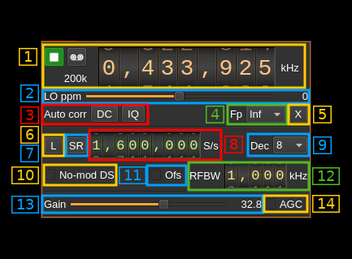

<h1>RTLSDR input plugin</h1>

<h2>Introduction</h2>

This input sample source plugin gets its samples from a [RTLSDR device](http://www.rtl-sdr.com/). 

<h2>Build</h2>

The plugin will be built only if the [RTLSDR host library](https://github.com/f4exb/librtlsdr) is installed in your system. If you build it from source and install it in a custom location say: `/opt/install/librtlsdr` you will have to add `-DLIBRTLSDR_INCLUDE_DIR=/opt/install/librtlsdr/include -DLIBRTLSDR_LIBRARIES=/opt/install/librtlsdr/lib/librtlsdr.so` to the cmake command line.

If you want to benefit from the direct sampling you will have to compile and install this library else the RTLSDR library is also provided by many Linux distributions. The SDRangel binary releases are compiled with the direct sampling option.

<h2>Interface</h2>

<h3>1: Common stream parameters</h3>

<h4>1.1: Frequency</h4>

This is the center frequency of reception in kHz.

<h4>1.2: Start/Stop</h4>

Device start / stop button. 

  - Blue triangle icon: device is ready and can be started
  - Green square icon: device is running and can be stopped
  - Magenta (or pink) square icon: an error occured. In the case the device was accidentally disconnected you may click on the icon, plug back in and start again.
  
<h4>1.3: Record</h4>

Record baseband I/Q stream toggle button

<h4>1.4: Stream sample rate</h4>

Baseband I/Q sample rate in kS/s. This is the device sample rate (4) divided by the decimation factor (6). 

<h3>2: Local Oscillator correction</h3>

This is the correction to be applied to the local oscillator in ppm.

<h3>3: Auto correction options</h3>

These buttons control the local DSP auto correction options:

  - **DC**: auto remove DC component
  - **IQ**: auto make I/Q balance
  
<h3>4: Baseband center frequency position relative the the BladeRF Rx center frequency</h3>

Possible values are:

  - **Cen**: the decimation operation takes place around the BladeRF Rx center frequency
  - **Inf**: the decimation operation takes place around the center of the lower half of the BladeRF Rx passband. 
  - **Sup**: the decimation operation takes place around the center of the upper half of the BladeRF Rx passband. 

<h3>5: Toggle low/high sample rate range</h3>

When button is on the sample rate can vary from 230 kS/s to 300 kS/s
When button is off the sample rate can vary from 950 kS/s to 2400 kS/s

<h3>6: Device sample rate</h3>

This is the device sample rate in samples per second (S/s).

Use the wheels to adjust the sample rate. Left click on a digit sets the cursor position at this digit. Right click on a digit sets all digits on the right to zero. This effectively floors value at the digit position.

<h3>7: Decimation factor</h3>

The I/Q stream from the RTLSDR ADC is doensampled by a power of two before being sent to the passband. Possible values are increasing powers of two: 1 (no decimation), 2, 4, 8, 16, 32.

<h3>8: Direct sampling mode</h3>

Use this checkbox to activate the special RTLSDR direct sampling. This can be used to tune to HF frequencies.

<h3>9: RF gain</h2>

This is the RF gain setting in dB. The values are defined in the RTLSDR device and generally are: 0.0, 0.9, 1.4, 2.7, 3.7, 7.7, 8.7, 12.5, 14.4, 15.7, 16.6, 19.7, 20.7, 22.9, 25.4, 28.0, 29.7, 32.8, 33.8, 36.4, 37.2, 38.6, 40.2, 42.1, 43.4, 43.9, 44.5, 48.0, 49.6