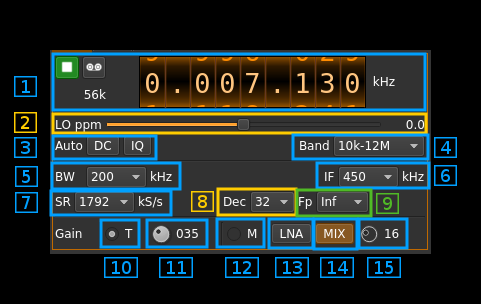

<h1>SDRplay plugin</h1>

<h2>Introduction</h2>

This plugin supports input from SDRplay devices. SDRplay is based on the MSi001 and MSi2500 chips from Mirics. The standard API provided by Mirics is closed source moreover it could not be implemented successfully in SDRangel. An open source API libmirisdr-2 has been written by Miroslav Slugen and later amended by Leif Asbrink SM5BSZ. This API uses a new flavour called [libmirisdr-4](https://github.com/f4exb/libmirisdr-4) in this very same Github space. It contains enhancements and bug fixes.

<b>Note to Windows users:</b> 

this plugin uses the libusbK USB interface provided by [Zadig](http://zadig.akeo.ie). It will not work with any of the other drivers provided by Zadig. It is also not compatible with the drivers from Mirics so you will have to unistall (or you should not install) the Mirics software before you can use this plugin. 

Use it at your own risk! If the device disconnects you will immediately get a BSOD. In Linux it is just a core dump.

Also sometimes when loading a preset the device will not work correctly. In this case just use the stop/start toggle to reset the device.

<h2>Build</h2>

As mentioned already the plugin depends on libmirisdr-4. You will have to compile it and install it in your system. When installed in non standard folders the include and library paths have to be specified on the cmake command line. Say if you install `libmirisdr-4` in `/opt/install/libmirisdr` you will have to add `-DLIBMIRISDR_INCLUDE_DIR=/opt/install/libmirisdr/include -DLIBMIRISDR_LIBRARIES=/opt/install/libmirisdr/lib/libmirisdr.so` on the cmake command line.

<h2>Interface</h2>

<h3>1. Common controls</h3>

Controls common to all source plugins. See [main interface description](../../../sdrbase/readme.md).

<h3>2. Local oscillator frequency correction</h3>

This is the correction in tenths of ppm steps. This is hardly useful with SDRplay as it has been found on spot. The MSi001 chip probably uses some sort of internal compensation. However this control is kept just in case.

<h3>3. DC and IQ imbalance correction</h3>

These controls are also common with many source plugins. IQ imbalance is hardly useful but SDRplay is affected by DC bias when used at zero IF.

<h3>4. Band selection</h3>

This selects a frequency range corresponding to the hardware path in the SDRplay. Bands available are:

  - 10 kHz to 12 MHz
  - 12 MHz to 30 MHz
  - 30 MHz to 50 MHz
  - 50 MHz to 120 MHz
  - 120 MHz to 250 MHz
  - 250 MHz to 380 MHz
  - 380 MHz to 1 GHz
  - 1 GHz to 2 GHz
  
<h3>5. IF bandwidth</h3>

This selects the IF filter. Following bandwidths are available according to MSi001 specs:

  - 200 kHz
  - 300 kHz
  - 600 kHz
  - 1536 kHz
  - 5000 kHz
  - 6000 kHz
  - 7000 kHz
  - 8000 kHz

<h3>6. IF frequency</h3>

This selects the IF frequency between these values:

  - 0 for zero IF
  - 450 kHz: you have to set sample rate to 1792 kHz (7) and use decimation (8) with an infradyne position (9)
  - 1620 kHz: you have to set sample rate to 6400 kHz (7) and use decimation (8) with an infradyne position (9)
  - 2048 kHz: you have to set sample rate to 8192 kHz (7) and use decimation (8) with an infradyne position (9)  
  
<h3>7. Sample rate</h3>

You have the choice between various sample rates from 1536 to 8192 kHz. Some values have a special destination:

  - 1792 kHz: for use with an IF of 450 kHz.
  - 6400 kHz: for use with an IF of 1620 kHz.
  - 8192 kHz: for use with an IF of 2048 kHz.
  
<h3>8. Decimation</h3>

Decimation in powers of two from 1 (no decimation) to 64.

<h3>9. Center frequency position</h3>

Relative position of center frequency of decimated baseband relative to the original:

  - Inf: infradyne i.e. in the lower half of original baseband: to be used with non zero IFs
  - Cen: Centered i.e. around the center of the original baseband
  - Sup: Supradyne i.e. in the upper half of original baseband
  
<h3>10. Tuner gain mode</h3>

Use this radiobutton to select a mode where the gain of the LNA (or mixer buffer below 50 MHz), mixer and baseband amplifiers are automatically selected depending on the tuner gain index (11). This index is the gain value in dB at the nominal gain of all amplifiers. This is not the exact gain at all frequencies because the LNA gain decreases significantly at higher frequencies. 

<h3>11. Tuner gain setting</h3>

The tuner gain index can be set between 0 and 102 points (corresponds to dB in the nominal case).

<h3>12. Manual gain mode</h3>
 
Use this radiobutton to select a mode where the gain of all amplifiers can be set independently

<h3>13. LNA toggle</h3>

Toggle button to switch on or off the LNA (bands above 50 MHz) or mixer buffer (bands below 50 MHz). The nominal gain is +24 dB.

<h3>14. Mixer amplifier toggle</h3>

Toggle button to switch on or off the mixer amplifier. The gain of this amplifier is +19 dB.

<h3>15. Baseband amplifier gain</h3>

Baseband amplifier gain from 0 to 59 dB.
