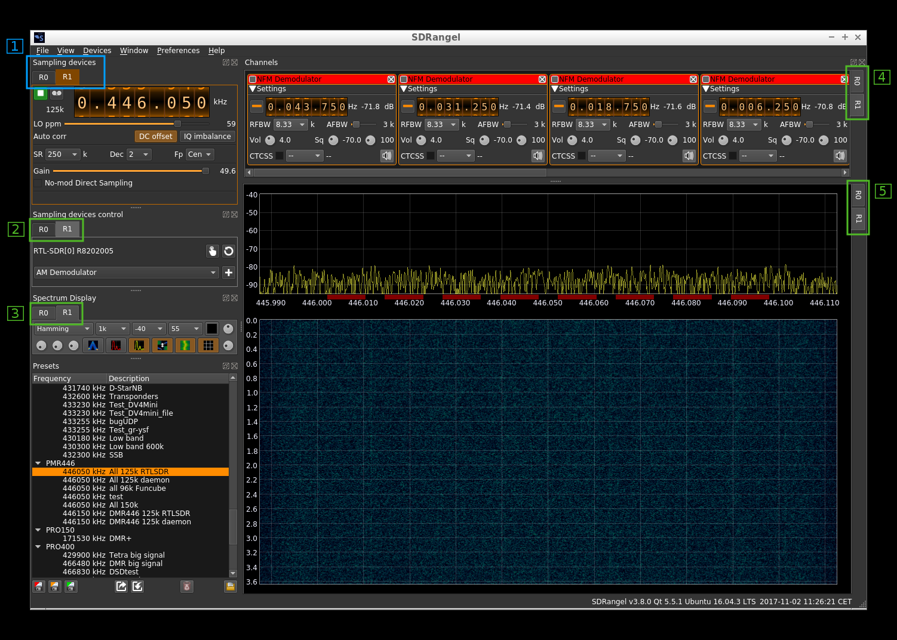
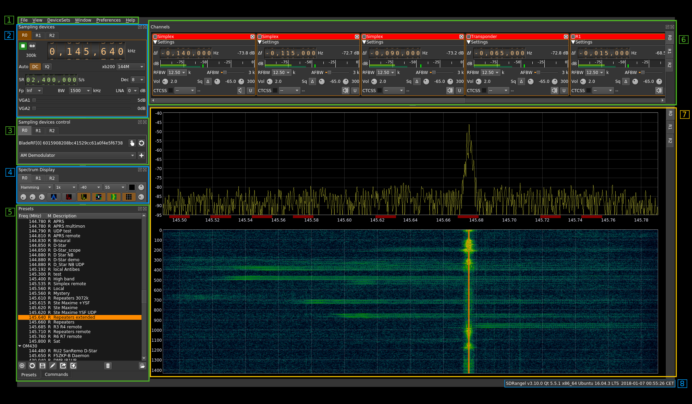
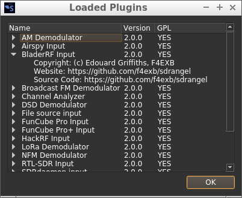
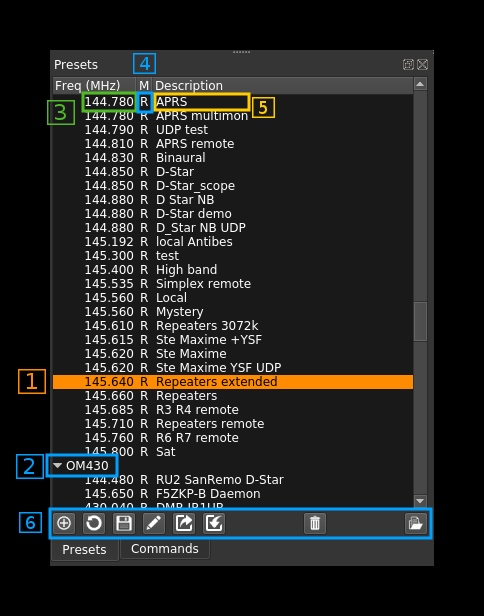
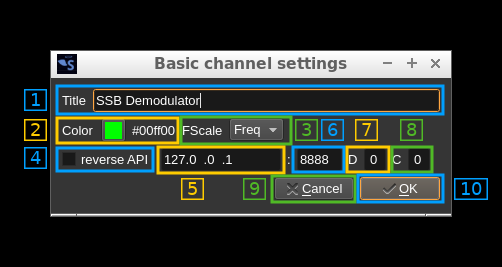

<h1>Main Window interface</h1>

<h2>Multi device support</h2>

Starting with version 2 SDRangel supports several sampling devices simultaneously. Each concurrent device is associated to a slot with a set of tabbed windows in the UI. These tabs are marked R0, R1, R2... 

The slots are arranged in a stacked fashion so that when a new device is added with the Acquisition -> Add device menu a new slot is allocated in the last position and when a devcie is removed with the Acquisition -> Remove device menu the slot in the last position is deleted. Slot 0 (R0) receiver slot is created at initialization and cannot be deleted with the menu. The letter "R" in the tab names indicates that the slot is for a receiver (source) device while "T" designates a tramsmitter (sink) device.

The tabbed windows are:

  - Sampling devices (1)
  - Sampling devices control (2)
  - Spectrum display control (3)
  - Channels (4)
  - Spectrum from device (5)

The sampling devices tab (1) acts as a master and when one of its tabs is selected all other tabs are selected accordingly i.e. all R0s, all R1s, etc... in tabs (2), (3), (4) and (5)

In each slave tab group (2), (3), (4) and (5) an individual tab corresponding to one device can be selected without affecting the selection of the other tabs. This way you can sneak peek into another spectrum or channel goup without affecting the display of other tabbed windows.

<h2>Interface details</h2>

<h3>1. Main menu</h3>

The following items are presented hierarchically from left to right:

  - File:
    - _Exit_ (shortcut Ctl-Q): Exit the program
  - View:
    - _Fullscreen_ (Shortcut F11): Toggle full screen mode
  - Devices:
    - _Add source device_: adds a new source (receiver) device slot to the device stack (last position)
    - _Add sink device_: adds a new sink (transmitter) device slot to the device stack (last position)
    - _Remove device_: removes the last device slot from thte device stack
    - _Reload devices_: re-scan the system for devices. Devices selectors are updated with new devices and missing devices are removed. All devices must be stopped for this to take effect. 
  - Window: presents the list of dockable windows. Check to make it visible. Uncheck to hide. These windows are:
    - _Sampling devices control_: control of which sampling devices is used and add channels
    - _Sampling devices_: the sampling devices UIs
    - _Spectrum display_: the main spectrum displays (output from the sampling devices)
    - _Presets_: the saved presets
    - _Channels_: the channels active for each device
  - Preferences:
    - _Audio_: opens a dialog to choose the audio output device (see 1.1 below for details)
    - _DV Serial_: if you have one or more AMBE3000 serial devices for AMBE digital voice check to connect them. If unchecked DV decoding will resort to mbelib if available else no audio will be produced for AMBE digital voice
    - _My Position_: opens a dialog to enter your station ("My Position") coordinates in decimal degrees with north latitudes positive and east longitudes positive. This is used whenever positional data is to be displayed (APRS, DPRS, ...). For it now only works with D-Star $$CRC frames. See [DSD demod plugin](../plugins/channel/demoddsd/readme.md) for details on how to decode Digital Voice modes.
  - Help:
    - _Loaded Plugins_: shows details about the loaded plugins (see 1.2 below for details)
    - _About_: current version and blah blah.    

<h4>1.1. Preferences - Audio</h4>

Audio output preferences:

In the "Audio Output" tab of the audio preferences dialog you can choose which device is used for audio output. This choice is global for the application and is persistent. If the device is not available anymore at a later stage it reverts to the default devuce (first row).

Audio input preferences:

In the "Audio Input" tab of the dialog you can choose the device used for audio input in a similar way as you do for the output device.

In addition you can adjust the global volume using the dial knob at the bottom. Audio input behaves slightly differently than audio output and when the audio engine is started the volume is forced to a value that by default is maximum (1.0). This is not always desirable and using this control you can set it at a lower level (0.00 to 1.00 in 0.01 steps). 

Eventually select "OK" to confirm the settings or "Cancel" to dismiss without change.

<h4>1.2. Loaded plugins display</h4>

When clicking on Help -> Loaded Plugins from the main menu bar a dialog box appears that shows information about the plugins loaded in SDRangel:

<h5>Name</h5>

Plugin display name. Tells briefly what this plugin is about.

<h5>Version</h5>

Starting with SDRangel version 2.0.0 this is the SDRangel version when the plugin was last updated.

<h5>GPL</h5>

Tells if the plugin is under GPL license.

<h5>Expansion</h5>

The plugin entry can be expanded or collapsed using the caret on the left. When expanded it shows more information about the copyright of the author and locations on the web where the plugin can be found. In all cases this is just here.

<h5>OK button</h5>

Click here when done to dismiss the dialog.

<h3>2. Sampling devices</h3>

This is where the plugin GUI specific to the device is displayed. Control of one device is done from here. The common controls are:

<h4>2.1. Start or stop acquisition</h4>

  - When a play icon is displayed with a grey background the device is not operational
  - When a play icon is displayed with a blue background the device is ready to start
  - When a square icon is displayed with a green background the device is currently running
  - When a play icon is displayed with a red background there is an error and a popup displays the error message. An Error typically occurs when you try to start the same device in more than one tab.
  
<h4>2.2. Record I/Q</h4>

This is the I/Q from device record toggle. When a red background is displayed the recording is currently active. The name of the file created is `test_n.sdriq` where `n` is the slot number.

The format is S16LE I/Q samples. Thus there are 4 bytes per sample. I and Q values are 16 bit signed integers. The file starts with a context header containing information about center frequency, sample rate and timestamp of the start of the recording. This header has a length which is a multiple of a sample size (normally 24 bytes thus 6 samples). Thus this file can be used as a raw I/Q file with S16LE samples tolerating a glitch at the start corresponding to the 6 "random" samples. 

You can also zap the 24 bytes header with this Linux command: `tail -c +25 myfile.sdriq > myfile.raw`

To convert in another format you may use the sox utility. For example to convert to 32 bit (float) complex samples do:
`sox -r 48k −b 16 −e signed-integer -c 2 myfile.raw -e float -c 2 myfilec.raw`

Note that you have to specify the sampling rate and use `.raw` for the file extensions.

<h4>2.3. Device sampling rate</h4>

This is the sampling rate in kS/s of the I/Q stream extracted from the device after possible decimation. The main spectrum display corresponds to this sampling rate.

<h4>2.4. Center frequency</h4>

This is the current center frequency in kHz with dot separated thousands (MHz, GHz). On devices for which frequency can be directly controlled (i.e. all except File Source and SDRdaemon) you can use the thumbwheels to set the frequency. Thumwheels move with the mouse wheel when hovering over a digit. 

When left clicking on a digit a cursor is set on it and you can also use the arrows to move the corresponding thumbwheel.

When right clicking on a digit the digits on the right are all set to zero. This effectively does a ceil rounding at the current position.

<h4>Additional inputs</h4>

Most devices will also present an interface to control automatic DC removal and I/Q imbalance and also a control of the LO correction in ppm.

  - Example1: 
  - Example2: 

<h3>3. Sampling devices control</h3>

This is where the sampling device for one device set is selected and the channel plugins are instantiated.

<h4>3.1. Sampling device selector</h4>

Use this combo box to select one sampling device

<h4>3.2. Sampling device selection confirmation</h4>

Use this push button to confirm the selection and change the sampling device

<h4>3.3. Channel selector</h4>

Use this combo box to select a channel plugin to create a new channel

<h4>3.4. Add a new channel</h4>

Use this push button to add a new channel with the selected plugin

<h3>4. Spectrum display control</h3>

These are the controls of the main spectrum display in (7). Please refer to the spectrum display documentation (TBD) for details.

<h3>5. Presets</h3>

This is a tree view of the saved presets. Presets record the channels setup and a copy of the settings of each sample source that has been used when saving this preset. Thus you can use the same channel arrangement with various devices having their particular setup.

<h4>5.1. Preset selection</h4>

You select a preset by clicking on its line in the tree view. All actions (5) will be done relative to this preset.

<h4>5.2. Group</h4>

You can organize your presets into groups. Groups can be collapsed or expanded by using the caret icon on the left.

<h4>5.3. Center frequency</h4>

The center frequency used in this preset is displayed here.

<h4>5.4. Preset name</h4>

You can give a name to your preset. Names need not to be unique.

<h4>5.5. Preset control or actions</h4>

The controls are located as icons at the bottom of the window: 

<h5>5.5.1. New preset</h5>

Click on this icon to create a new preset with the current values in the selected sample device tab (Main window: 2).

<h5>5.5.2. Update preset</h5>

Click on this icon to create a update the selected preset with the current values in the selected sample device tab (Main window: 2). Please note that this does not save the preset immediately on disk to save presets immediately you need to use the next icon.

<h5>5.5.3. Save presets</h5>

Presets are saved to disk automatically at exit time you can however request to save them immediately using this icon.

<h5>5.5.4. Export preset</h5>

Using the previous icon presets are saved globally in a system dependent place. Using this icon you can export a specific preset in a single file that can be imported on another machine possibly with a different O/S. The preset binary data (BLOB) is saved in Base-64 format.

<h5>5.5.5. Import preset</h5>

This is the opposite of the previous operation. This will create a new preset in the selected group or the same group as the preset being selected.

<h5>5.5.6. Delete preset</h5>

This deletes the selected preset. It takes no action if a group is selected.

<h5>5.5.7. Load preset</h5>

Applies the selected preset to the current device set (source and channel plugins).  

<h3>6. Channels</h3>

This area shows the control GUIs of the channels curently active for the device. When the preset is saved (as default at exit time or as a saved preset) the GUIs are ordered by increasing frequency. If presets share the same frequenccy they are ordered by their internal ID name. Thus new channel GUIs will appear ordered only when reloaded.

Details about the GUIs can be found in the channel plugins documentation which consits of a readme.md file in each of the channel plugins folder (done partially).

With these channels: AM demod, BFM demod, DSD demod, NFM demod, UDP source, UDP sink some common basic settings can be set with a popup dialog. This dialog is opened by clicking on the small grey square on the top left of the channel window. The settings are as follows:

<h4>6.1: Window title</h4>

Changes the channel window title

<h4>6.2: Channel color</h4>

Changes the color of the window title bar and spectrum overlay. To change the color click on the color square to open a color chooser dialog. The hex rgb value is displayed next to the color square.

<h4>6.3: Frequency scale display type</h4>

When the mouse is over the channel window or over the central line in the spectrum a channel parameter is displayed on the frequency scale. This parameter can be:

  - Freq: channel absolute center frequency
  - Title: channel window title
  - AdSnd: UDP address and send port
  - AdRcv: UDP address and receive port
  
<h4>6.4,5,6: UDP address (4) receive port (5) and send port (6)</h4>

Some channels can exchange data over UDP. Depending on the channel the data is the following:

<table>
  <tr>
    <th>Channel</th>
    <th>Data sent</th>
    <th>Type</th>
    <th>Data received</th>
    <th>Type</th>
    <th>Address</th>
  </tr>
  <tr>
    <td>AM demod</td>
    <td>Audio</td>
    <td>Mono</td>
    <td>N/A</td>
    <td>N/A</td>
    <td>Remote</td>
  </tr>
  <tr>
    <td>BFM demod</td>
    <td>Audio</td>
    <td>Stereo</td>
    <td>N/A</td>
    <td>N/A</td>
    <td>Remote</td>
  </tr>  
  <tr>
    <td>DSD demod</td>
    <td>Audio</td>
    <td>Stereo</td>
    <td>N/A</td>
    <td>N/A</td>
    <td>Remote</td>
  </tr>  
  <tr>
    <td>NFM demod</td>
    <td>Audio</td>
    <td>Mono</td>
    <td>N/A</td>
    <td>N/A</td>
    <td>Remote</td>
  </tr>
  <tr>
    <td>UDP source</td>
    <td>Audio, I/Q</td>
    <td>Mono, Stereo</td>
    <td>Audio</td>
    <td>Mono</td>
    <td>Remote</td>
  </tr>
  <tr>
    <td>UDP sink</td>
    <td>N/A</td>
    <td>N/A</td>
    <td>Audio, I/Q</td>
    <td>Mono, Stereo</td>
    <td>Local</td>
  </tr>
</table>
  
Data type is S16LE 1 channel (Mono) or 2 channels (Stereo or I/Q)

<h4>6.7: Validate and exit dialog</h4>

Validates the data (saves it in the channel marker object) and exits the dialog

<h4>6.8: Cancel changes and exit dialog</h4>

Do not make any changes and exit dialog

<h3>7. Spectrum from device</h3>

This shows the spectrum in the passband returned from the sampling device possibly after decimation. The actual sample rate is shown in the device control at the left of the frequency display (2.3)

The spectrum display is cotrolled by the display control (4).
 
<h3>8. Status</h3>

<h4>8.1. SDRangel version</h4>

Self explanatory

<h4>8.2. Qt version</h4>

Qt version with which this copy of SDRangel was compiled.

<h4>8.3. System</h4>

Pretty print of the system in which SDRangel is running.

<h4>8.4. Local date</h4>

Local date according to system clock

<h4>8.5. Local time</h4>

Local time according to system clock followed by the time zone code.

